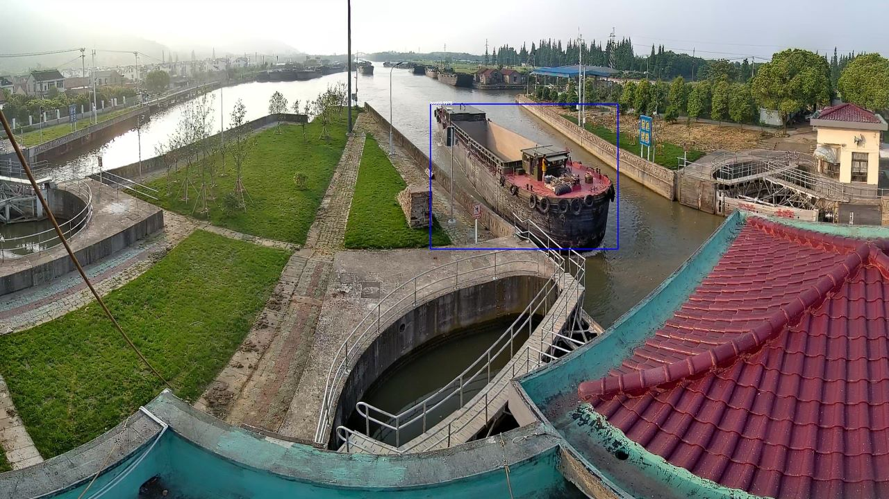
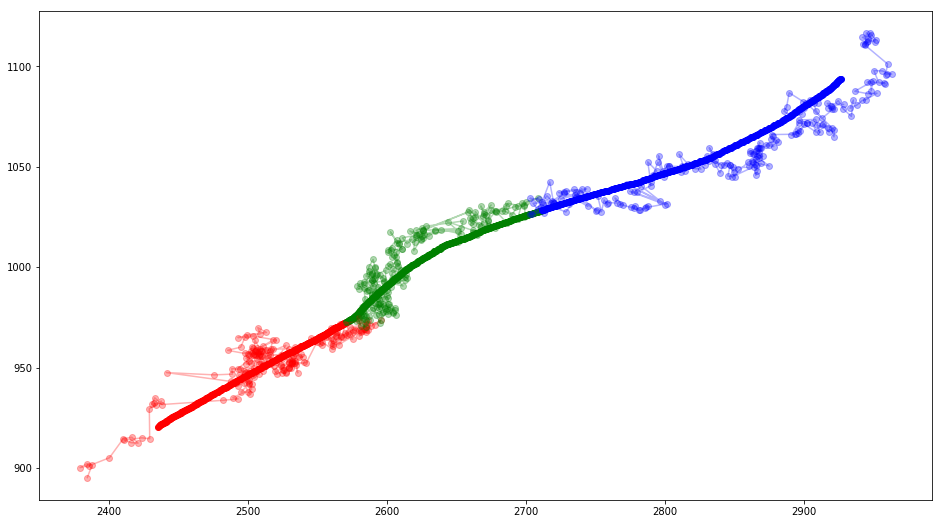
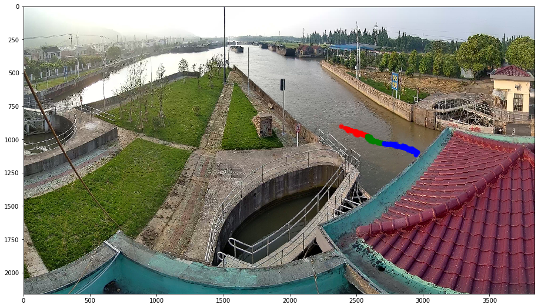
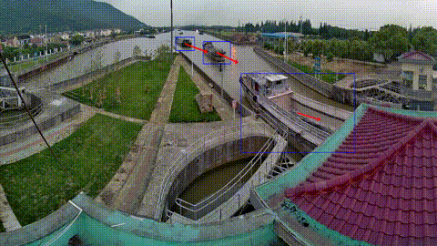

# Ship Tracking Processing based on SSD detection

We have a a trained SSD model to detect ships in river, thus for every frames, some boxes covering a ship can be created 
in "trained region"(Well, maybe better call it "trained size" since the too small ship is not labeled in training dataset.)
For example:

## Algorithm



### Building sequence and smoothing

Considering those boxes are very close to each other in neighbor frames, 
we can choose a threshold to determine whether a box is matched with a box (if exist) in next frame. 
If a match is established, we can draw a arrow from center of previous one to center of next one to indicate velocity or direction.
But since the box given by SSD model is not that perfect to represent a consistent shape
(Especially, we can observe the center drift and shape distortion).
So we can try to match the box in next frame with next next one and next next next one to form a sequence, treat the drift and distortion
as random noise, a simple average smoothing is ideal enough to suppress the two distortion to recover a nice trace with arrow.
A smoothing result is shown below:



Though it seems a little over-smoothing, but true trace should be a some straight line, so it's better call the little bending "system noise". 
The trace in corresponding "background" is shown below.



The Red,Green,Blue region denote trace in `0~1/3, 1/3~2/3, 2/3~1` time interval respectively. So we observe a direction point to right-bottom.

### Jump tolerance matching and interpolation

As you may see, the trace shown above is not "full". In fact, it's half part of a full trace of ship from up-left to right-bottom.
It's cut because the SSD net is failed to detect a box in a middle frame of "full" frame sequence. 
It may be called third main noise introduced by model.
How can we to dealt it? A frame "jump" tolerance threshold(I use 10) is made to enable "merging" of two sequence or skip matching. 
Thus if a full sequence with "jump" be found, we can interpolate some fake frames into sequence to prevent many ugly disappearing boxes glitch.

The final result, as a result of such those classical filtering technical post-processing, is shown below: 


## Usage

The raw input is a 30+ hours, 120Gb video. The seeking of `ffmpeg` on it is too slow, so firstly we split them into 10min sections:

```
ffmpeg -i D1_2019051018142078.mp4 -c copy -map 0 -segment_time 00:10:00 -f segment -reset_timestamps 1 output%03d.mp4
```

Then we can split a section into frames as such
(i.e. split section `.\videos\output003.mp4` into frames `output003_frames/thumb00001.jpg`,`output003_frames/thumb00002.jpg`):

```
ffmpeg -i .\videos\output003.mp4 output003_frames/thumb%05d.jpg
```

Then apply `batch_predict` in `predict_batch.py` as such(well I don't write a CLI interface, you may call it from interactive command line
or Jupyter notebook):

```python
dataset_images = BasicDataset('output003_frames', base_transform)
dataloader_images = DataLoader(dataset_images, batch_size, shuffle = False)
batch_predict(net, dataloader_images, verbose=True, predict_dir='output003_cache')
```

The `net` and `base_transform` is provided by module.

Now result of predication of SSD network is stored in `output003_cache`. Apply `cache_to_arrowed` in `test_batch.py` as such:

```python
cache_to_arrowed('output003_cache', 'output003_frames', 'output003_processed_int', verbose=True, resize_factor=4, chain_smoother=adaptive_chain_smoother,jump_tol=10,interpolation=True)
```

Now outputs of SSD are collected and post-processed, corresponding image with box and arrow are saved into `output003_processed_int`.

Generate video or gif from it maybe helpful to visualize the result. 
Call `generate_video_from_dir` from `video_utils.py` to rename files and construct command using `ffmpeg` to generate video as such:

```python
generate_video_from_dir('output003_processed_int')
```

The result seems like this:

```
ffmpeg -framerate 24 -i output003_processed_int/img%06d.jpg output003_processed_int_output.mp4
```

Now you have a nice video named `output003_processed_int_output.mp4` in your root folder of project, a `gif` can be generated by replace `mp4` in
command with `gif`. Or generate a section from generated video as such:

```
ffmpeg -i output003_processed_int_output.mp4 -vf scale=480:-1 -ss 0:55 -t 0:10 output003.gif
```

 A down-sampled example gif is shown below:


